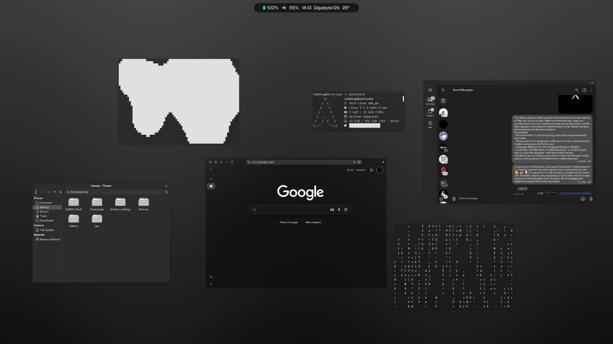

# driftwm rice



<video src="preview.mp4" controls width="600"></video>

## Install

```bash
git clone https://github.com/latency-tech/driftwm-dotfiles.git
cd driftwm-dotfiles
./install.sh
```

## Dependencies

### Core
| Package | Description |
|---|---|
| [driftwm](https://github.com/AquariusPower/DriftWM) | Infinite canvas Wayland compositor |
| [quickshell](https://quickshell.outfoxxed.me/) | Qt6 shell framework |
| [chillpill-shell](https://github.com/nickvision-apps/chillpill-shell) | Tide-Island bar for Quickshell |

### Apps
| Package | Description |
|---|---|
| foot | Wayland terminal |
| fuzzel | Application launcher |
| swaylock-effects | Lock screen with blur/effects |
| grim + slurp | Screenshots + region selection |
| cliphist | Clipboard manager |
| gpu-screen-recorder | Hardware screen recording |
| brightnessctl | Display brightness |
| playerctl | Media player control |
| wl-clipboard | Wayland clipboard |

### Fonts
| Package | Description |
|---|---|
| otf-geist | Geist — sans-serif + monospace |
| otf-geist-mono-nerd | Geist Mono with Nerd Font icons |
| 0xProto | Terminal monospace font |

### Theme
| Package | Description |
|---|---|
| graphite-gtk-theme | GTK dark theme |
| catppuccin-mocha (CSS) | Catppuccin Mocha overlay |
| tela-circle-icon-theme-grey | Monochrome icon theme |
| bibata-cursor-theme | Cursor theme |

## Keybindings

| Key | Action |
|---|---|
| `Super+Return` | Terminal |
| `Super+D` | Launcher (fuzzel) |
| `Super+L` | Lock screen |
| `Super+B` | Dashboard |
| `Super+N` | Control center |
| `Super+V` | Clipboard history |
| `Super+E` | File manager |
| `Super+Q` | Close window |
| `Super+F` | Fullscreen |
| `Super+Print` | Screen recording (toggle) |
| `Print` | Screenshot region |
| `Super+1-4` | Go to workspace |
| `Super+arrows` | Center window |
| `Super+Shift+arrows` | Nudge window |
| `Super+Ctrl+arrows` | Pan viewport |
| `Alt+Tab` | Cycle windows |

## Features

- **Infinite canvas** — unlimited workspace with smooth panning and zooming
- **Blur** — Kawase blur on terminal, browser, and UI elements
- **Weather** — 7-day forecast from Open-Meteo (Bakhchysarai)
- **Monochrome** — fully monochrome terminal, launcher, and bar
- **GTK theming** — Graphite-Dark + Catppuccin Mocha CSS overlay
- **Screen recording** — gpu-screen-recorder with region select
- **Shader wallpapers** — GLSL animated backgrounds
